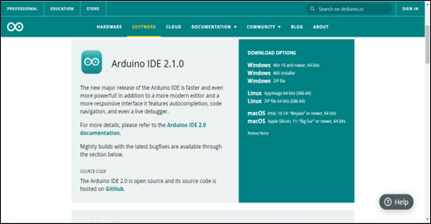
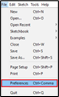
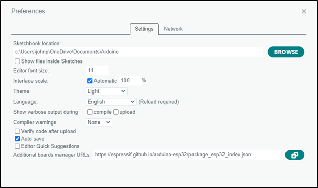
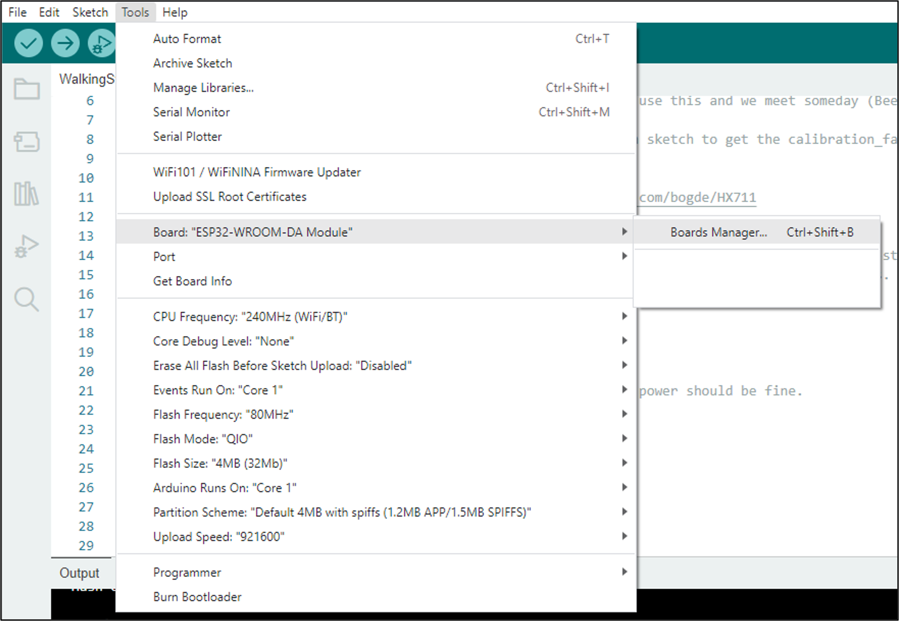
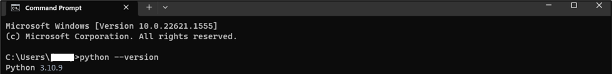
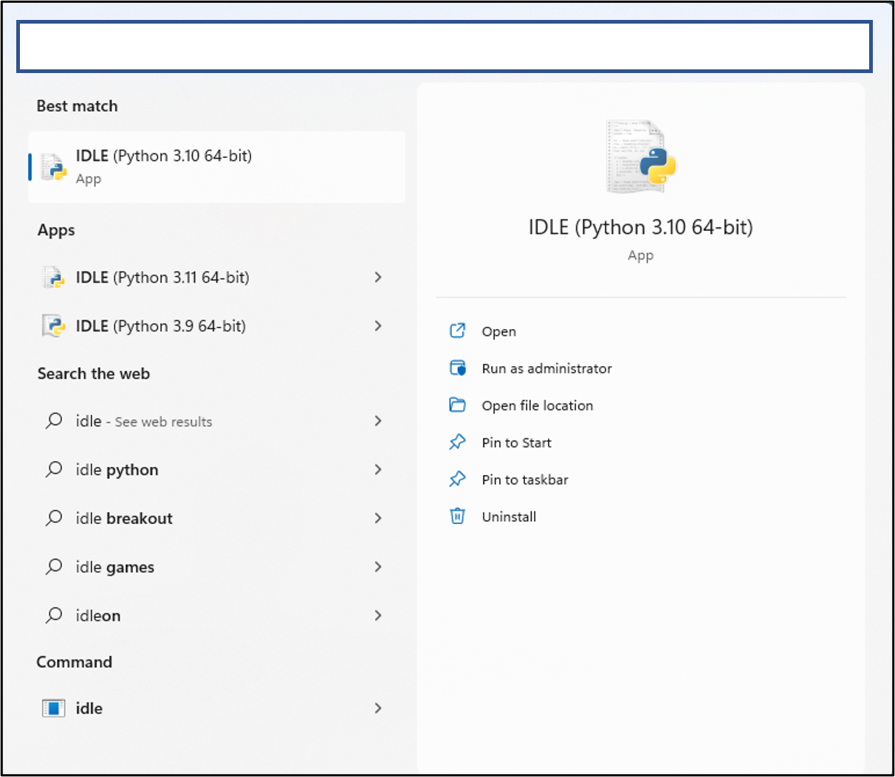

# Instrumented_Walking_Pole

This combination of Arduino and python code reads data from an instrumented walking pole via Bluetooth and plots the data in real time. Following data collection, data can be exported as a csv.  
The instrumented walking pole is drilled in the middle and connected to a loadcell. The loadcell is connected to a circuit using an ESP32 microcontroller, an HX711 loadcell amplifier, and a 9V battery. 
DO NOT CONNECT ANYTHING TO YOUR COMPUTER UNTIL YOU ARE INSTRUCTED TO DO SO!

# Step 1: Install Arduino IDE on your device.
An IDE is an Integrated Development Environment. This is basically the application where you write code in. This IDE is for uploading code to the Arduino microcontroller used for the walking pole. 
- Visit Arduino’s Website and download the latest version of the Arduino IDE (Figure 1). 
- Make sure to download the IDE corresponding with your operating system.  
  
Figure 1 – Arduino Website

# Step 2: Input Board Manager URL in Arduino IDE
This project uses a microcontroller called the ESP32-WROOM-DA Module. We have decided to use this board because of its fast processor, low cost, and its ability to stream data via Bluetooth. A quick tutorial on this board can be found here (https://randomnerdtutorials.com/esp32-bluetooth-classic-arduino-ide/). In order to use this microcontroller with the Arduino IDE, we need to first put a link in the IDE telling it where to find the “board manager” for this specific board. 
- In the Arduino IDE, go to File -> Preferences. 
 
- In the “Additional boards manager URLs” text box (Figure 2), paste in the following link:
 https://raw.githubusercontent.com/espressif/arduino-esp32/gh-pages/package_esp32_index.json
- If there is already a link in this box, or if you would like to add more than one link, select the icon to the right of the text box, and then separate your links by line (Figure 3).   
  
Figure 2 – Arduino IDE Preferences    
  
Figure 3 – Adding multiple board manager URLs  
- Press OK when you are finished. 

# Step 3: Install Board Manager for ESP32
- Select the “tools” tab on the top toolbar of the Arduino IDE and navigate to “Board” -> “Boards Manager” (Figure 4).   
  
Figure 4 – Navigating to “Boards Manager”  

- In the boards manager search bar, search esp32 and install the module from “Espressif Systems” (Figure 5).   
  
Figure 5 – Downloading the board module for the esp32  
- At this point, you should be able to navigate back to your boards and find the ESP-32-WROOM-DA Module, which you should now select (Figure 6).     
  
Figure 6 – Selecting the ESP32 from Boards Manager   

# Step 4: Ensure that the Arduino IDE can find the ESP32
- You may now connect the esp32 to your computer after you read the following warning
- WARNING: Do not connect the esp32 to your computer if it is also connected to a battery! This can fatally harm your computer. Disconnect the battery from the esp32 before connecting to your computer. 
- From the sketch screen of the Arduino IDE, select the “Select Board” drop-down and select “Select other board and port…” (Figure 7)   
  
Figure 7 – Select Board   
- Enter esp32-wroom in the search bar to find our board, then select the port that it is connected to on your computer
- Note: The esp32 must be connected to the computer using a micro-USB cable.   
  
Figure 8 – Selecting board and port  
- If no ports are shown, your computer may not be recognizing the esp32. To check this, navigate to your device manager and see if there is a device under “other devices” with a yellow warning icon on it. If this is the case, you need to download an additional driver found here (https://www.silabs.com/developers/usb-to-uart-bridge-vcp-drivers?tab=downloads). 
  - Download the latest zipped driver to your computer and extract it to your desktop so it’s easy to find.
  - Right click on the device in “other devices” in your device manager and select “update driver.”
  - Allow your computer to automatically find the driver or manually navigate to it on your desktop.
  - Now, your computer should be able to recognize your esp32 and list your available ports. Select the port that your esp32 is connected to

# Step 5: Upload Arduino Code to the esp32
- Open the WalkingStick_ESP_BT code in the Arduino IDE
- Ensure that you still have the correct board and port connected (see above)
- Verify the code by selecting the checkmark on the top left of the screen. 
- Once verification is complete, upload the code to the board by selecting the arrow on the top left of the screen. This may take a minute or two.
- Once the code has successfully uploaded, you may disconnect your computer from the Arduino and reconnect the Arduino to its battery. It is very important that you do not connect to the battery until AFTER you have disconnected from your computer. It is okay if the Arduino loses power during this switch. The code has now been uploaded to the board and the board will remember the code when it reconnects to a power source. 

# Step 6: Install Python
- Download the installer for python 3.10.9 for your operating system here (scroll to bottom of the page to find installers)
  - A later version of python may work, but 3.10.9 has proven to be the most successful.
- Before proceeding with the install, make sure you add python to your path (Figure 9).  
   
Figure 9 – Installing Python    
- You can now follow the recommended installation by selecting “install now.”

# Step 7: Verify Python is Working
- First verify that python is running on your computer by going to your command prompt or terminal and entering “python --version”. You should see the desired response in Figure 10.  
  - For windows, type “cmd” in your search bar to find the command prompt
  - For Mac, search “terminal” in your launchpad to find the terminal 

 
Figure 10 – Checking that python is working in command prompt. 

# Step 8: Install Necessary Packages
- There are 2 ways this can be done. Option 1 is recommended.
- Option 1: Install the necessary packages using the requirements.txt file
  - Download the provided requirements.txt file to your computer
  - Open your command prompt
  - Access the folder that your requirements.txt file is located in command prompt using the “cd” command
  - For example, if the requirements.txt file is located in my downloads, I would enter the following: “cd C:\Users\johnp\downloads”  
    
  - The directory should change after you press enter (see below)  
    
  - Now enter the command to download the requirements.txt file to import the necessary packages  
    
  - After pressing enter, all packages will be installed on your computer 

- Option 2: Install the necessary packages manually in the command prompt using the “pip” command
  - Open your command prompt
  - You will enter “pip install _________” and press enter for each package   
    
  - You will input one package on each line
  - Ex: “pip install pyserial” then press enter 
       “pip install numpy” then press enter 
       and so on… 
- Necessary packages (enter the exact name after “pip install ____”)
  - U wxPython
  - matplotlib
  - numpy
  - pandas
  - pyserial
  - pybluez2

# Step 9: Run the python code
- Ensuring the Arduino code has been uploaded to the walking stick and that the stick is on and connected to battery power, you can finally run the python code!
- Open IDLE (downloaded with python)  
 
- On the toolbar, select “File” -> “Open” and locate your main.py file  
 
- On the toolbar, select “Run” -> “Run Module”  
 
 

