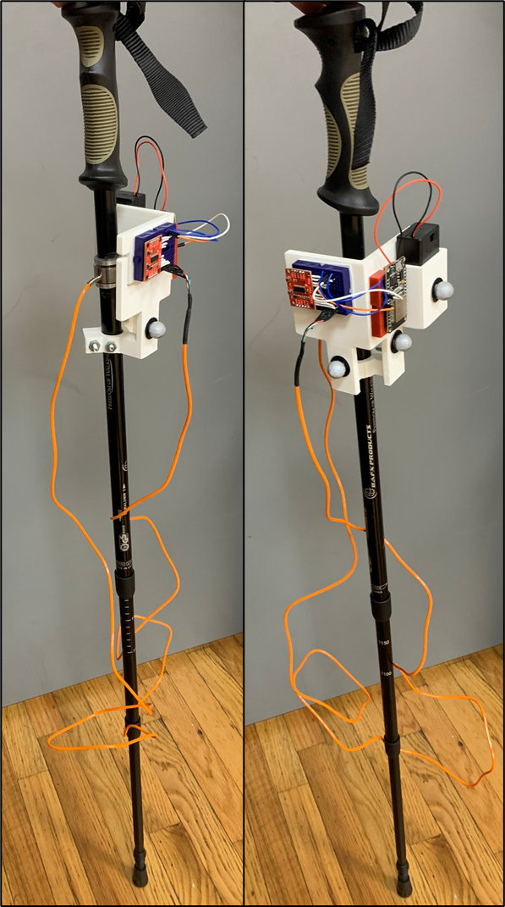
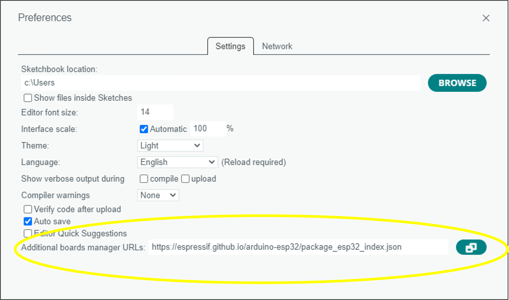
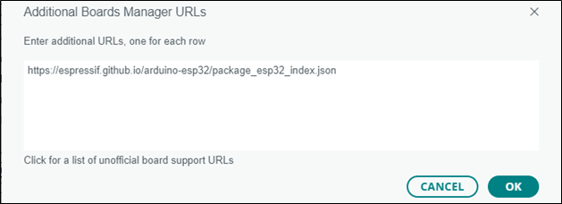
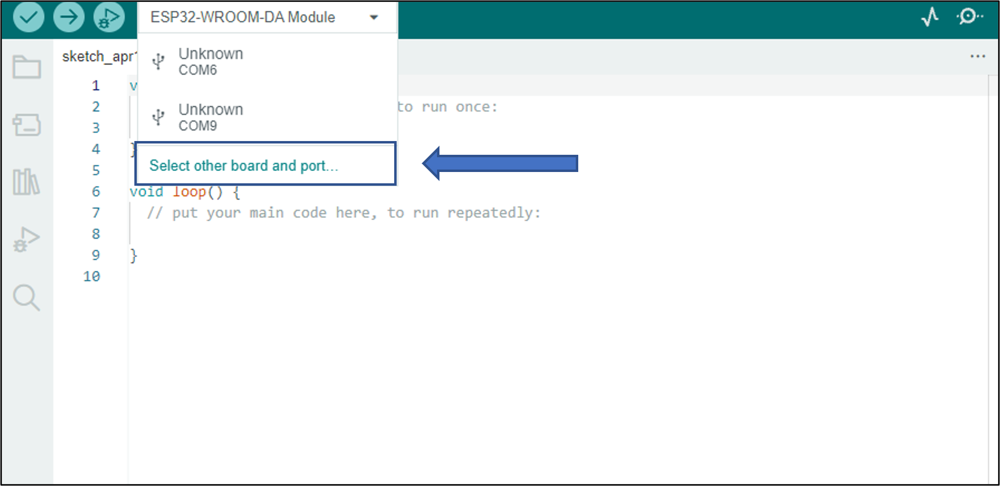
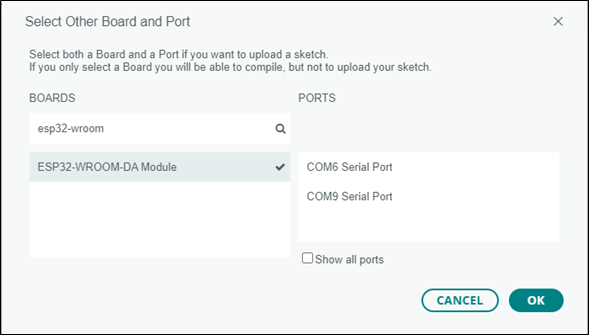
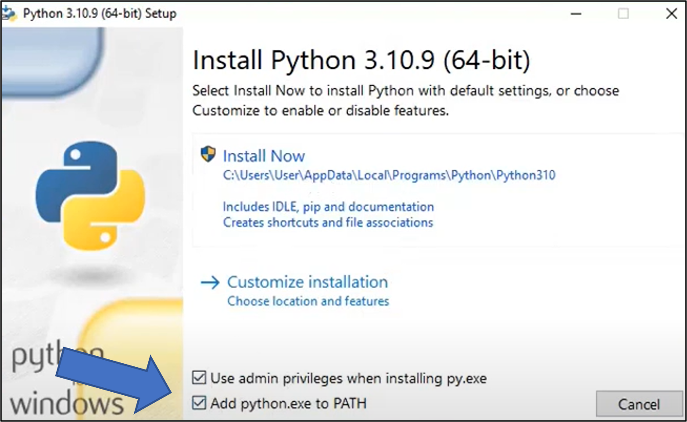
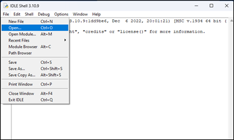
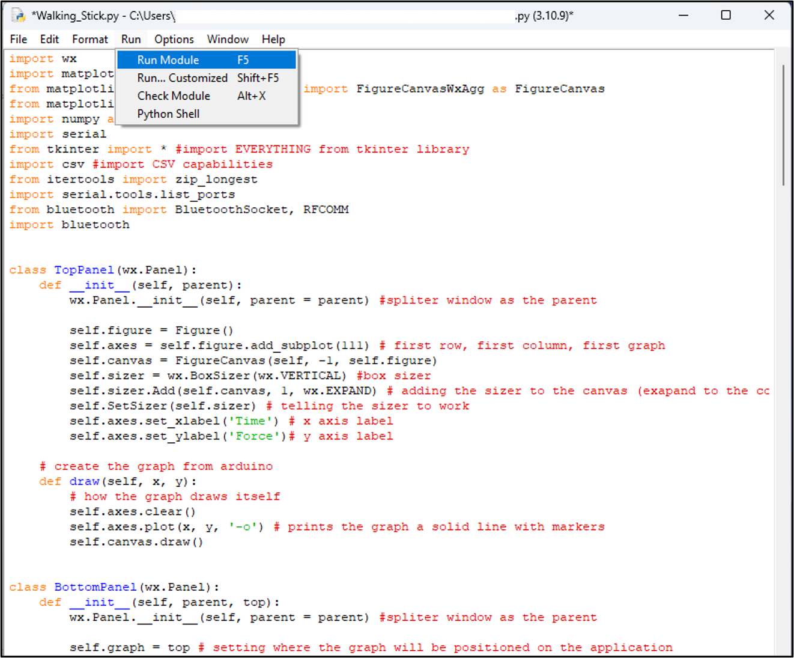

# Walking_Pole

We drilled out the middle of a nordic walking pole and replaced it with a load cell. 
- This combination of Arduino and Python code reads data from the walking pole via bluetooth and plots the data in real time. Timestamped data can be exported as a csv.  
- We created a resin housing, secured with epoxy and screws, to attach to the pole.     

     

### Materials:
- [ESP32 Wroom Dev Module](https://www.amazon.com/Development-Microcontroller-Integrated-Antenna-Amplifiers/dp/B09GK74F7N/ref=sr_1_1_sspa?adgrpid=1335907260628949&hvadid=83494414425840&hvbmt=be&hvdev=c&hvlocphy=99507&hvnetw=o&hvqmt=e&hvtargid=kwd-83494609850672%3Aloc-190&hydadcr=24332_13514996&keywords=esp32+dev+module&qid=1702242786&sr=8-1-spons&sp_csd=d2lkZ2V0TmFtZT1zcF9hdGY&psc=1)
- [Nordic Walking Pole](https://bafxpro.com/products/hikingpoles)
- [Load Cell](https://caltsensor.com/product/inline-load-cells-dymh-103/)
- [HX711 Load Cell Amplifier](https://www.sparkfun.com/products/13879)
- [Small Breadboards](https://www.amazon.com/HiLetgo-SYB-170-Breadboard-Colorful-Plates/dp/B071KCZZ4K/ref=sr_1_2_sspa?adgrpid=1333708840092947&hvadid=83357000896351&hvbmt=be&hvdev=c&hvlocphy=99507&hvnetw=o&hvqmt=e&hvtargid=kwd-83357641838384%3Aloc-190&hydadcr=953_1014987051&keywords=small+breadboards&qid=1702243778&s=industrial&sr=1-2-spons&sp_csd=d2lkZ2V0TmFtZT1zcF9hdGY&psc=1)
- [9 Volt Battery Holder](https://www.amazon.com/Battery-Leads%EF%BC%8CWidely-Student-Experiments-Batteries/dp/B09XBKT1DG/ref=sr_1_7_sspa?keywords=9v%2Bbattery%2Bclip&qid=1702244060&sr=8-7-spons&sp_csd=d2lkZ2V0TmFtZT1zcF9tdGY&th=1) - This will allow you to turn the battery on or off with a switch. 
- [9 Volt Battery](https://www.amazon.com/Amazon-Basics-Performance-All-Purpose-Batteries/dp/B00MH4QM1S/ref=sr_1_1_ffob_sspa?crid=K1BZ4V4UTB2Y&keywords=9v+battery&qid=1702244141&rdc=1&sprefix=9v+battery%2Caps%2C79&sr=8-1-spons&sp_csd=d2lkZ2V0TmFtZT1zcF9hdGY&psc=1)
- [Buck Converter](https://www.adafruit.com/product/4683)
- [Jumper Wires](https://makeradvisor.com/tools/jumper-wires-kit-120-pieces/)
- Other hardware will depend on the housing you use.

   DO NOT CONNECT THE WALKING POLE TO YOUR COMPUTER IF THE 9V BATTERY IS CONNECTED AND TURNED ON.

### Circuit:
##### Circuit With Buck Converter  
    

##### Circuit Without Buck Converter  
    

The purpose of the buck converter is to step down the 9V battery to 3.3V, which is what the ESP-32 is designed to handle. The ESP-32 could be damaged or experience instability if 9V is supplied directly to it. 

Notice that with the buck converter setup, the battery is wired to the 3.3V pin on the ESP-32, because the voltage is properly stepped down. Without the buck converter, the battery is wired to the Vin pin on the ESP-32. This Vin pin is supposed to regulate the voltage on its own, so you can technically connect a 9V battery directly to it. However, this will waste power as heat, making the circuit less efficient (battery will die faster). 

The setup with the buck converter will make the circuit work more efficiently, but either setup should work.

## Step 1: Install Arduino IDE on your device.
An IDE is an Integrated Development Environment. This is the application where you write code. This IDE is for uploading code to Arduino microcontrollers. 
- Visit [Arduino’s Website](https://www.arduino.cc/en/software) and download the latest version of the Arduino IDE (Figure 1). 
- Make sure to download the IDE corresponding with your operating system.  
  
Figure 1 – Arduino Website

## Step 2: Input Board Manager URL in Arduino IDE
This project uses a microcontroller called the ESP32-WROOM-DA Module. We have decided to use this board because of its fast processor, low cost, and its ability to stream data via Bluetooth. A quick tutorial on this board can be found [here](https://randomnerdtutorials.com/esp32-bluetooth-classic-arduino-ide/). In order to use this microcontroller with the Arduino IDE, we need to first put a link in the IDE telling it where to find the “board manager” for this specific board. 
- In the Arduino IDE, go to File -> Preferences. 
 
- In the “Additional boards manager URLs” text box (Figure 2), paste in the following link:
 https://raw.githubusercontent.com/espressif/arduino-esp32/gh-pages/package_esp32_index.json
- If there is already a link in this box, or if you would like to add more than one link, select the icon to the right of the text box, and then separate your links by line (Figure 3).   
  
Figure 2 – Arduino IDE Preferences    
  
Figure 3 – Adding multiple board manager URLs  
- Press OK when you are finished. 

## Step 3: Install Board Manager for ESP32
- Select the “tools” tab on the top toolbar of the Arduino IDE and navigate to “Board” -> “Boards Manager” (Figure 4).   
  
Figure 4 – Navigating to “Boards Manager”  

- In the boards manager search bar, search esp32 and install the module from “Espressif Systems” (Figure 5).   
  
Figure 5 – Downloading the board module for the esp32  
- At this point, you should be able to navigate back to your boards and find the ESP-32-WROOM-DA Module, which you should now select (Figure 6).     
  
Figure 6 – Selecting the ESP32 from Boards Manager   

## Step 4: Ensure that the Arduino IDE can find the ESP32
- You may now connect the esp32 to your computer after you read the following warning
- WARNING: Do not connect the esp32 to your computer if it is also connected to a battery! This can fatally harm your computer. Disconnect the battery from the esp32 before connecting to your computer. 
- From the sketch screen of the Arduino IDE, select the “Select Board” drop-down and select “Select other board and port…” (Figure 7)   
  
Figure 7 – Select Board   
- Enter esp32-wroom in the search bar to find our board, then select the port that it is connected to on your computer
- Note: The esp32 must be connected to the computer using a micro-USB cable.   
  
Figure 8 – Selecting board and port  
- If no ports are shown, your computer may not be recognizing the esp32. To check this, navigate to your device manager and see if there is a device under “other devices” with a yellow warning icon on it. If this is the case, you need to download an additional driver found here (https://www.silabs.com/developers/usb-to-uart-bridge-vcp-drivers?tab=downloads). 
  - Download the latest zipped driver to your computer and extract it to your desktop so it’s easy to find.
  - Right click on the device in “other devices” in your device manager and select “update driver.”
  - Allow your computer to automatically find the driver or manually navigate to it on your desktop.
  - Now, your computer should be able to recognize your esp32 and list your available ports. Select the port that your esp32 is connected to

## Step 5: Upload Arduino Code to the esp32
- The "Arduino Code" folder in this repository contains the following 3 scripts:
   - LoadCellCalibration: This sketch will help you identify the calibration factor for your load cell. More information can be found at this [link](https://learn.sparkfun.com/tutorials/load-cell-amplifier-hx711-breakout-hookup-guide/all) under *Installing the HX711 Arduino Library and Examples*
   - Print_Force_Serial: This sketch will print force readings to the serial monitor in the Arduino IDE. You can use this sketch to check your output values from the ESP32.
   - Print_Force_BT: This sketch will print force readings via bluetooth. This is the code you need to run the  Python interface that reads force via bluetooth. 
- Once you have successfully uploaded the Print_Force_BT code, you may disconnect the ESP32 from your computer and reconnect it to its battery. It is very important that you do not connect to the battery until AFTER you have disconnected from your computer. It is okay if the Arduino loses power during this switch. The code has now been uploaded to the board and the board will remember the code when it reconnects to a power source. 

## Step 6: Run the Executable File and Collect Data
- The walkingpole_live_plot.exe file allows you to run the GUI without having to install python or any other dependencies to your computer. If you choose to use this executable, you are done.   

# If You're Not Using the Executable...
- If you haven't already, install Python [here](https://www.python.org/downloads/) (scroll to bottom of the page to find installers)
- Before proceeding with the install, make sure you add python to your path (Figure 9).  
   
Figure 9 – Installing Python    

## Install Necessary Packages
Install the necessary packages manually in the command prompt using the “pip” command
  - Open your command prompt
  - Enter “pip install _________” for each package   
    
- Necessary packages (enter the exact name after “pip install ____”)
  - wxPython
  - matplotlib
  - numpy
  - sys
  - csv
  - pybluez
    - If you are having trouble installing pybluez: 
      - pybluez requires Microsoft C++ Build Tools, which you can install at the following link: https://visualstudio.microsoft.com/visual-cpp-build-tools/
      - During installation, make sure to select **Desktop Development with C++** and **Universal Windows Platform Development**
      - Restart your computer and try again to install pybluez
 
## Run the Python Code
- Ensuring the Arduino code has been uploaded to the walking stick and that the stick is on and connected to battery power, you can finally run the python code!
- Open IDLE (downloaded with python)  
 
- On the toolbar, select “File” -> “Open” and locate your main.py file  
 
- On the toolbar, select “Run” -> “Run Module”  
 
 

